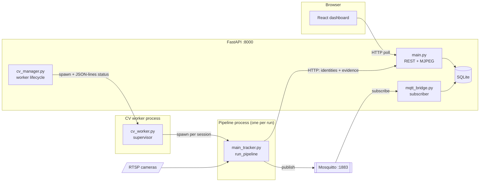
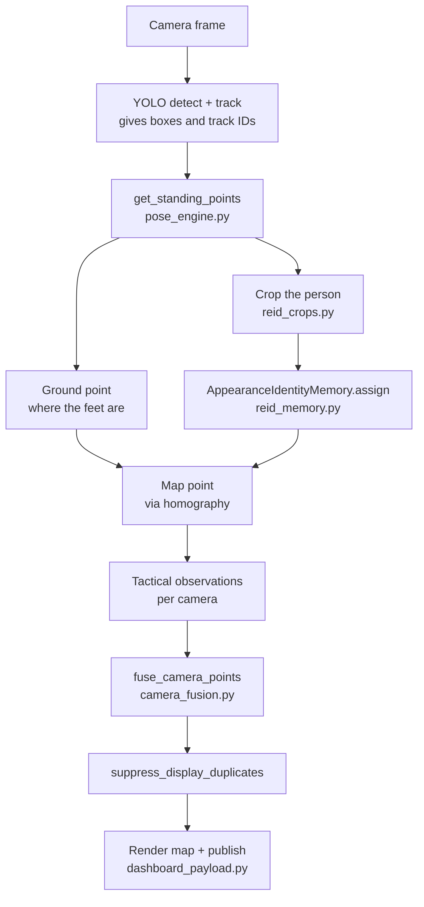

# Architecture

How this system works, for a developer who has just been handed the repository.

`README.md` tells you how to *run* it. `plan.md` records how the project
*evolved*. This document tells you how a camera frame becomes a numbered person
on the dashboard, and which file to open when something goes wrong.

---

## 1. What the system does

One or two RTSP cameras watch a space. The system detects the people in view, works out
where each one is standing on a shared floor plan, decides which detections in
different cameras are the *same person*, gives that person a stable number that
survives them walking out of one camera and into the other, and publishes the
result to an operator dashboard along with an evidence photo, an estimated age
and gender, and a role (evacuee or staff).

Two is the maximum, and it is hard-coded rather than configurable:
`main_tracker.build_camera_contexts` reads `--source` and an optional
`--source-2`. Supporting a third camera is a real change, not a config edit.

The hard part is not detection. It is deciding that the person camera 1 can see
and the person camera 2 can see are one person and not two — and never getting
that wrong in a way that puts a duplicate on the map or hands one person's
identity to another. Most of the code exists for that problem.

---

## 2. Processes and how they talk

Four processes run in a deployment. They are deliberately separate: the CV
pipeline holds the GPUs and can crash or be restarted without taking the
dashboard down.



**FastAPI backend** (`backend/`) serves the REST API, the compiled React app,
and the MJPEG camera streams. It owns the SQLite database. It does no computer
vision itself.

**CV worker supervisor** (`edge_tracker/cv_worker.py`) is a long-lived process
started by `backend/cv_manager.py`. It preloads the models once — YOLO,
MediaPipe, TransReID, the role classifier, MiVOLO — and then waits. It reports
its state (`offline`, `loading`, `ready`, `starting`, `running`, `stopping`,
`failed`) to the backend as JSON lines on stdout. This is why the dashboard can
say "models loading" and only enable **Start Session** when they are ready.

**Pipeline process**, one fresh process per run, is where the tracking actually
happens (`main_tracker.run_pipeline`). A fresh process per run means a session
cannot inherit corrupted CUDA or tracker state from the previous one.

**Mosquitto** carries the per-cycle results on three topics: `cag/tactical`
(positions and people), `cag/metrics` (counts), `cag/alerts`. The tracker
publishes; `backend/mqtt_bridge.py` subscribes and writes to SQLite.

There is a second entry point. `launch_tracker_ubuntu.sh` runs the engineering
launcher (`launcher_ui.py` → `main_tracker.py`) directly, exposing every
threshold and toggle. It and the dashboard worker share configuration
construction (`launch_config.py`) and a runtime ownership lock
(`session_lock.py`), so they cannot fight over the cameras and GPUs.

**Persistence is split by purpose.** Live per-cycle state goes over MQTT because
it is high-frequency and disposable. Identities and their evidence photos go
over HTTP directly to the backend (`reid_backend_store.py` → 
`/api/evacuees/by-master/{run_id}/{master_id}`) because they must not be lost.

---

## 3. The frame pipeline

Inside the pipeline process, one cycle looks like this. Both cameras are
processed in parallel on a thread pool, then their results are fused.



Reading the stages in order:

1. **Capture.** `camera_stream.py` runs a reader thread per camera so a slow or
   stalled RTSP feed cannot block the pipeline. Frames carry a capture timestamp
   and sequence number, so the fusion stage knows how stale each camera is.

2. **Detect and track.** YOLO produces boxes; the tracker config
   (`ocsort_ghost_resistant.yaml`) assigns short-lived local track IDs. These IDs
   are *per camera* and are not identities — they break constantly.

3. **Per-detection analysis** — `pose_engine.get_standing_points`, the busiest
   function in the system. For each box it: crops the person, rejects crops
   another person has intruded into, runs MediaPipe for body landmarks,
   determines which way the person faces, estimates where their feet meet the
   floor, and hands the crop to the identity memory.

4. **Ground point.** `ground_point.py` decides where the person actually stands.
   This matters more than it sounds: the bottom of a detection box is the
   person's feet only when the feet are visible and unoccluded. Points are
   graded `hard`, `soft`, or `stale`, and a soft point may support a match but
   never veto one. `core_math.camera_point_to_map` projects it through the
   calibrated homography into shared floor coordinates in centimetres.

5. **Identity.** See section 4.

6. **Fusion.** `camera_fusion.fuse_camera_points` pairs observations from
   different cameras into one fused person, using distance on the floor plan and
   agreement about identity. `suppress_display_duplicates` then removes
   remaining visual duplicates — presentation only, deliberately last, after
   everything that feeds the identity layer has already consumed its inputs.

7. **Publish.** `dashboard_payload.py` chooses which fused people are fit to
   show, builds the payloads, and ships them to MQTT and HTTP.

---

## 4. Identity: the part that needs explaining

`reid_memory.AppearanceIdentityMemory` is the largest and hardest component
(7,600 lines). Everything in it exists to answer one question safely: *is this
newly seen person somebody we already have a number for?*

**Intake burst.** A brand new local track does not immediately get an identity.
It must first contribute five quality-controlled crops — sharp enough, body
complete, no other person intruding. Those five are processed as one batch by a
background thread. This is why a new person shows "Analyzing" briefly.

**Features.** TransReID (`transreid_jpm.py`) turns crops into appearance
vectors. A colour-histogram fallback exists for when it is unavailable, and the
two must never be compared with each other — a *feature space ID* is carried
everywhere to enforce that.

**The gallery.** Each confirmed identity keeps five slots, named in
`REID_GALLERY_SLOTS`: `baseline`, `front`, `back`, `left_side`, `right_side`.
The baseline is the best of the intake burst by `sharpness × √area`; the other
four are filled opportunistically as the person turns. Slots store a feature
vector and a file path, never the image itself.

**Provisional vs confirmed.** An identity created from geometry alone —
two people walked close together and might be the same person — is
*provisional*, has a negative internal ID, and is shown as a temporary group. It
is promoted to a confirmed master only once appearance evidence agrees. Its
evidence photos are withheld until promotion, so an unverified guess can never
put one person's photo in another's folder.

**Arbitration.** When two tracks claim the same identity, or one track's
position contradicts its appearance, a *physical conflict* opens and is settled
by re-checking appearance over the next few frames. `cross_camera_provisional.py`
coordinates this across cameras.

**Background workers.** Four daemon threads keep GPU and disk work off the frame
loop: `reid-analyst` (feature extraction and matching), `demographics-analyst`
(MiVOLO), `reid-evidence-sender` (PNG writing), `reid-persistence` (HTTP saves).

**Demographics.** Age and gender come from MiVOLO V2 (`demographics.py`), fed a
face crop located from the pose landmarks (`face_region.py`) and a body crop cut
back to the tight detection box. Crops are ranked by how much face they offer,
and the estimate re-runs if a much closer view of the person appears later.

**Role.** A MobileNet classifier (`reid_models.py`) decides evacuee vs staff.
Staff never receive a demographics estimate.

---

## 5. Module map

### `edge_tracker/` — the CV pipeline

Most modules carry a one-line docstring saying what they own; read that first.
They are layered, and the layering is enforced by convention: a module does not
import anything that imports it back.

**Entry points**
| File | Role |
|---|---|
| `cv_worker.py` | Dashboard supervisor; one fresh pipeline process per run |
| `main_tracker.py` | The per-frame pipeline and the cycle loop |
| `launcher_ui.py` | Engineering launcher GUI |
| `tracker_cli.py` | Argument surface and torch runtime setup |
| `launch_config.py` | Shared launch configuration for both entry points |

**Per-frame stages**
| File | Role |
|---|---|
| `camera_stream.py` | Threaded RTSP readers with capture metadata |
| `pose_engine.py` | The per-detection pass |
| `mediapipe_runtime.py`, `mediapipe_landmarks.py` | Pose estimator and landmark reading |
| `ground_point.py` | Where a person meets the floor, and how much to trust it |
| `human_orientation.py` | Which way they face; head pitch |
| `reid_crops.py`, `reid_crop_quality.py` | Cropping, and whether a crop is fit to store |
| `face_region.py` | Face box from pose landmarks, for MiVOLO |

**Identity**
| File | Role |
|---|---|
| `reid_memory.py` | The identity memory — start here, and budget time |
| `reid_models.py` | TransReID extractor and role classifier |
| `transreid_jpm.py` | The TransReID model itself |
| `cross_camera_provisional.py` | Location-first provisional coordination |
| `reid_backend_store.py` | HTTP persistence of identities and evidence |
| `reid_evidence_writer.py` | Lossless PNG writer subprocess |
| `demographics.py` | MiVOLO age and gender |

**Fusion, output, support**
| File | Role |
|---|---|
| `camera_fusion.py` | Cross-camera pairing and duplicate suppression |
| `fused_person.py`, `fusion_diagnostics.py` | Accessors, and why fusion decided what it did |
| `dashboard_payload.py` | What reaches the dashboard, and shipping it |
| `tactical_render.py` | Map and window drawing |
| `core_math.py` | Homography projection, distances, quality grades |
| `constants.py` | **Every tunable, with the reasoning behind its value** |
| `identity_debug.py` | Opt-in event log (`--debug-identity-events`) |
| `session_lock.py` | Stops two entry points owning the hardware at once |
| `tracker_calibration.py` | Homography persistence and four-corner calibration |
| `three_d_level.py`, `calibrate_elevated_plane.py` | Experimental two-plane metrology, off by default |

`constants.py` deserves special mention. It is not a bag of magic numbers — most
values carry a comment explaining what was measured and what breaks if you
change them. Read it before tuning anything.

### `backend/` — FastAPI

Feature packages: `auth/`, `runs/`, `evacuees/`, `evidence/`, `staff/`,
`reports/`. Top-level modules: `main.py` (app and general endpoints), `crud.py`,
`models.py`, `database.py`, `config.py` (all settings, `CV_*` environment
variables), `camera.py` (MJPEG), `cv_manager.py` (worker lifecycle),
`mqtt_bridge.py` (subscriber), `tactical_state.py` (in-memory latest state),
`zone_capacity.py`, `observation_storage.py`, `timeutils.py`.

### `frontend/` — React + Vite

`src/features/<feature>/` for feature views (passenger-assistance,
staff-review, runs, reports, admin), `src/components/` for shared components,
`src/components/ui/` for primitives, `src/lib/` for the API client and polling
hooks, `src/auth/` for the session provider. The dashboard polls HTTP; there is
no websocket. See `style.md` for the visual direction and component
responsibilities.

---

## 6. Where the data lives

| Data | Location | Lifetime |
|---|---|---|
| Identities, observations, metrics, alerts, users, runs | SQLite via SQLAlchemy | Permanent |
| Latest tactical state | `backend/tactical_state.py`, in memory | Until restart |
| ReID gallery (features, slots) | In memory; saved to backend over HTTP | Per run |
| Evidence PNGs | `edge_tracker/angle_evidence_v7/` by default, served through the API | Permanent |
| Identity event log | `LogEvidance/*.jsonl` | Per run, opt-in |
| Console logs | `LogEvidance/*.console.log` | Per run |

Crops themselves are working state and are never persisted onto an identity
record — records are pickled whole and deep-copied on every save, so a record
carrying images would write megabytes per save. Slots store features and file
paths only.

---

## 7. Suggested reading order

Two days to get productive, in this order:

1. `README.md`, then run the system. Watch the dashboard while someone walks in
   front of the cameras.
2. `main_tracker.run_pipeline` — the cycle loop. Do not read the whole file;
   read the loop and see what it calls.
3. `pose_engine.get_standing_points` — the per-detection pass, end to end.
4. `constants.py` — cover to cover. It is the design rationale in one file.
5. `camera_fusion.fuse_camera_points` — how two cameras become one person.
6. `reid_memory.py` — last, and expect it to take a while. Start at `assign`,
   then `_process_intake_task`, then the provisional promotion path.

Run a session with `--debug-identity-events` and read the resulting
`LogEvidance/*.jsonl` alongside the code. The event log names every decision the
identity layer makes, and is by far the fastest way to understand it.

---

## 8. Running the tests

There is no pytest in the environments; use `unittest`. Tests live in a `tests/`
package beside the code they exercise, and each suite runs from its own
directory. The `-t .` is required rather than cosmetic: the modules import each
other flatly (`from constants import ...` rather than
`from edge_tracker.constants import ...`), so discovery needs the parent as the
top-level directory to put it on `sys.path`.

```bash
# CV pipeline — ~560 tests, about 3 seconds
cd edge_tracker
../.venv-cv-linux/bin/python -m unittest discover -s tests -t .

# One file, verbose
../.venv-cv-linux/bin/python -m unittest tests.test_reid_intake_lifecycle -v
```

```bash
# Backend — 173 tests, about 50 seconds
cd backend
.venv-linux/bin/python -m unittest discover -s tests -t .
```

Note the two virtual environments are separate and not interchangeable:
`.venv-cv-linux/` at the root holds torch and the CV stack, `backend/.venv-linux/`
holds FastAPI. Neither has pytest installed.

Lint the first-party Python from the repository root:

```bash
uvx ruff check .
```

The CV tests run without a GPU, without cameras, and without loading any model
checkpoints — the models are stubbed. If a test run starts printing
`Initializing Official MiVOLO V2`, a test is loading a real model and should be
given a stub engine instead.

---

## 9. Known rough edges

Honest notes for whoever inherits this.

- **`reid_memory.py` is 7,600 lines in one class**, and several methods are
  several hundred lines each (`assign`, `_process_intake_task`,
  `_store_provisional_intake_locked`). It is the highest-value refactor target.
  The test suite is thorough enough to make splitting it safe.
- **`edge_tracker/` uses flat imports rather than a package**, because
  `cv_worker.py` is launched by path. Moving the pipeline modules into
  sub-packages would mean touching the launcher scripts and
  `cv_worker_script_path`, so the 34 modules stay in one directory. The tests
  have been split out into `edge_tracker/tests/`.
- **`backend/` mixes feature packages with loose top-level modules**
  (`main.py`, `crud.py`, `models.py` and friends). The tests now all live in
  `backend/tests/`, but the application modules are still half-organised.
- **Demographics only re-estimate while the gallery is filling.** Once an
  identity's five slots are full, no more pose landmarks are computed for it, so
  no face box exists and the age is fixed for the session.
- **Two-plane metrology (`three_d_level.py`) is experimental** and off by
  default. It logs in shadow mode and does not affect production positions.
- **`archive_v0/` is dead**, kept only for reference to the retired Streamlit
  prototype.

---

## 10. Conventions worth keeping

- **Comments explain *why*, not *what*.** Many constants cite the measurement
  that set them — for example the ReID intruder budget records the 14,148
  overlap rejections against 3,931 accepted crops that justified relaxing it.
  That reasoning cannot be recovered from the code, so preserve it.
- **Modules are layered and do not import in a cycle.** New code should keep
  that: a stage may import what it consumes, never what consumes it.
- **A test names the behaviour it protects**, not the function it calls
  (`test_a_staff_vote_drops_the_stashed_demographics_crops`).
- **Tunables live in `constants.py`** with their rationale, not inline.
